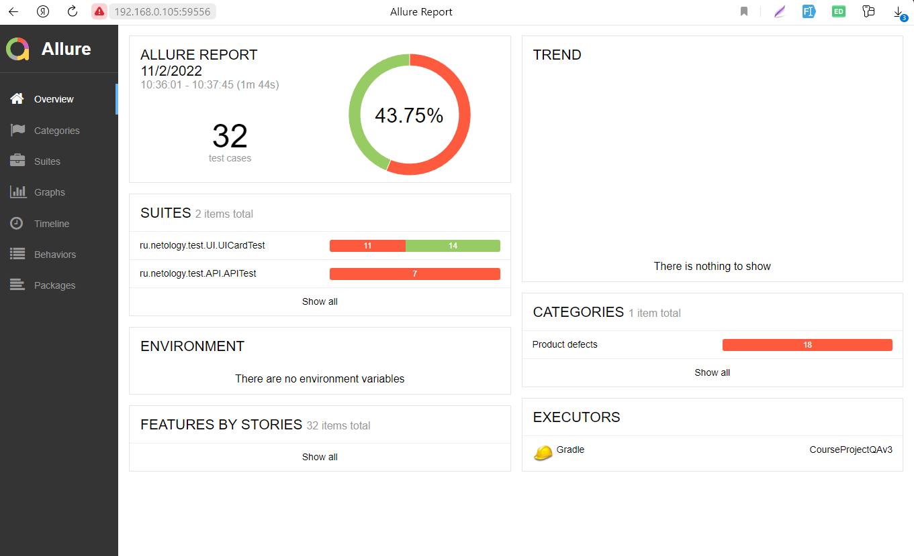

# Отчет о проведенном тестировании
## Краткое описание
Было проведено автоматизированное тестирование комплексного сервиса "Путешествие дня" для приобретения тура
с онлайн-оплатой картой и оплатой в кредит, взаимодействующего с СУБД и API банка.

В соответствии с составленным планом автоматизации были разработаны автоматизированные тесты UI,
тесты записи данных в БД, тесты API.

### Тестовые данные:
В качестве тестовых данных были предоставлены номера валидной и невалидной карт. 
Другие входные данные генерировались автоматически с помощью вспомогательных библиотек Java.

### Тестовое окружение:
* **Операционная система:** Windows 10 Pro Версия 21H2
* **IDE:** IntelliJ IDEA 2022.1.2 (Community Edition)
*  **Java:** OpenJDK 11 Eclipse Temurin version 11.0.14
* **Docker Desktop:** version 4.12.0
* **Google Chrome:** Версия 107.0.5304.62 (Официальная сборка) (64 бит)

### Тестирование

По итогам сформирован 

### Общие итоги:

|                  | Кол-во тестов | Passed | Failed | Passed, % |
|:-----------------|:-------------:|:------:|:------:|----------:|
| UI тестирование  |      25       |   14   |   11   |       56% |
| API тестирование |       7       |   0    |   7    |        0% |
| Всего            |      32       |   14   |   18   |    43,75% |

- падение API тестов связано с отсутствием валидации значений данных на backend.
- падение UI связано с отсутствием валидации вводимых значений в поле "владелец" формы заказа и некорректным формированием 
сообщений под полями форм. При этом формы с невалидными данными отправляются.

Было составлено 19 [issue](https://github.com/molottva/Diploma/issues)

#### Рекомендации:
- устранить обнаруженные и описанные в Issues дефекты в соответствии с указанной критичностью.
- обратить внимание на валидацию полей и конкретизировать сообщения при введинии не валидных данных.
- добавить уникальные идентификаторы на поля формы для возможности более надежного и стабильного автоматизированного тестирования.
- разработать техническую документацию на проект и БД.